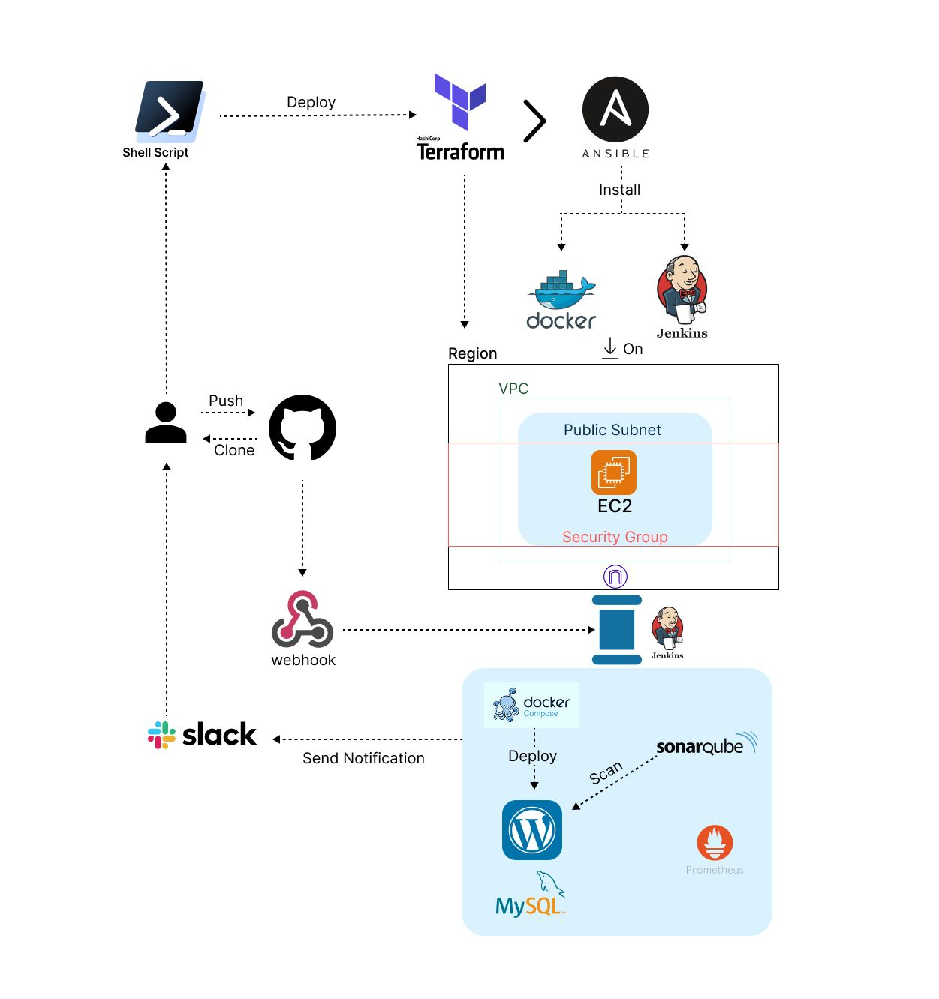

# DEPI DevOps Final Project

## Automated Deployment Pipeline with Jenkins and Docker

### Project Overview

- This project aims to automate the deployment of a Dockerized Word Press application on an AWS EC2 instance using Jenkins, Ansible, Terraform and Docker. It follows these steps:

- Diagram

1.	Terraform build infrastructure VPC, Public subnet , EC2.
2.	Ansible pushes configuration on EC2 to install Jenkins and Docker. 
3.	Jenkins triggers the pipeline to run Docker compose which Manages multi-container setups with MySQL and WordPress.
4.	SonarCloud is the cloud-hosted version of SonarQube. In this pipeline, the SonarScanner runs in a container to analyze the code and push the results to SonarCloud for quality checks.
5.	Notifications are sent via slack at the end of the build process
This ensures consistent deployments and eliminates manual processes.

## Prerequisites

•	AWS account and AWS cli

•	Ansible installed on local server

•	Terraform installed on local server

•	GitHub repository with Dockerized application code

## Infrastructure Setup Instructions

Clone the Repository:

git clone https://github.com/mostafa-sharkawy/Final-Project.git

cd Final-Project/

chmod +x deploy.sh

./deploy.sh

Deployment Script steps:

Initializing Terraform Resources:

Applying Terraform Resources:

•	The inventory file is automatically updated with the EC2 instance IP
•	A private key (mykey.pem) is generated for secure EC2 access

Configure SSH Access:

Update inventory files (Hosts file) which is located inside ansible directory and my key file created by terraform is redirected to ansible directory.

Runing Ansible playbook
Install Docker
Install Jenkins
Configure ports

Pipeline prerequisites:

Configure Jenkins Server
A-Install slack+sonar+blue ocean plugins
B-Configure slack, sonar and webhook on system jenkins.
On system Jenkins:
1- Configure Webhook: Manage push commits to trigger pipeline
2- Configure SonarQube: To analysis the code pipeline
3- Configure Slack: To integrate notifications from Jenkins to slack
Pipeline stages:
•	Set up test environment
•	Wait for WordPress
•	Install WordPress if not installed 
•	Sonar cloud Analysis
•	Run WordPress CLI Tests
•	Install and Activate Theme and Dummy data
•	Tear Down Test environment
•	Deploy to Production
Check our Application
 
Build Status Notification
 
Final Part
Destroy it 
This will:
1. Run 'terraform destroy' on: /home/Final-Project/Terraform
2. Remove sensitive files including:
   - Terraform state files
   - SSH keys (mykey.pem)
   - Ansible inventory/vars files
STEP 1: Destroying Terraform resources
STEP 2: Cleaning up sensitive files
=============================================
Removing: /home/Final-Project/Terraform/terraform.tfstate
Removing: /home/Final-Project/Terraform/terraform.tfstate.backup
Removing: /home/Final-Project/Ansible/mykey.pem
=============================================
Verification:
Checking for remaining sensitive files...
Technologies and Tools Used

Tool	Use Case
Docker	Containerization of applications for consistent environments across different systems.
Docker Compose	Defining and running multi-container Docker applications using a single configuration file.
Ansible	Automating software provisioning, configuration management, and application deployment.
Jenkins	Automating building, testing, and deploying code in CI/CD pipelines.
Terraform	Automating the provisioning of infrastructure resources across cloud platforms.
SonarQube	is a static application security testing (SAST) tool that analyzes source code for bugs, vulnerabilities, and code smells before deployment.
Prometheus	open-source monitoring and alerting toolkit, to monitor our application.

Team Members

•	Mostafa Naeem AbdElazeim

•	Sarah Salah Abdelghany

•	Zeyad Gamal Ahmed

•	Mahmoud Samy Mohamed

•	Mohrabil Atef Atteya Rizkallah

This README serves as a complete guide to understanding the project structure, setting up infrastructure, and configuring the Jenkins pipeline. It ensures a seamless deployment process with automation, notifications, and effective infrastructure management.

